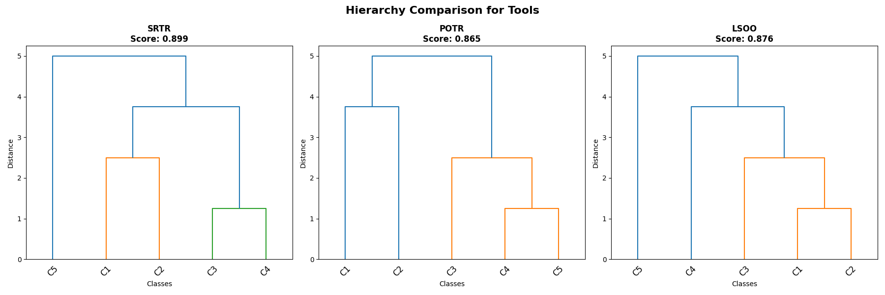

# 🧩 Stochastic Hierarchy Induction (SHI) for Time Series Classification
Author: Celal Alagoz  
License: MIT  
Python version: 3.10+  
Last updated: November 2025  

🌲 Overview  
This repository contains the official implementation of **Stochastic Hierarchy Induction (SHI)** — a framework for **classifier-informed automatic hierarchy generation** and **hierarchical classification (HC)** applied to time series data.  
The approach introduces **Stochastic Splitting Functions (SSFs)** — `potr`, `srtr`, and `lsoo` — that recursively partition class sets through performance-guided binary decisions, enabling discriminative top-down hierarchy construction.  
<p align="center">  <br> <em>Examples of hierarchies generated using SSFs: potr, srtr, and lsoo</em> </p>

---
## 🚀 Features
- **Automatic hierarchy generation (HG)** guided by classifier performance.
- **Three stochastic splitting functions (SSFs):**
  - `potr` – *Pick-One-Then-Regroup*
  - `srtr` – *Split-Randomly-Then-Regroup*
  - `lsoo` – *Leave-Salient-One-Out*
- **Hierarchical classification (HC)** using an extended Local Classifier Per Node (LCPN+) scheme.
- **Comparison against flat classification (FC)** with performance and runtime summaries.
- **Support for multiple base classifiers** (`MiniRocket`, `Quant`, `Cfire`).
- Visual examples of generated hierarchies for each SSF type.

---
## 🧩 Environment Setup

We recommend creating a fresh conda environment (Python 3.11) and installing dependencies as follows:

```bash
conda create -n ts_gpu_311 python=3.11 -y
conda activate ts_gpu_311

# GPU-enabled PyTorch
pip install torch torchvision torchaudio --index-url https://download.pytorch.org/whl/cu126

# Core dependencies
pip install pytorch-lightning aeon[all_extras] tsfresh>=0.20.1 prince>=0.16.0 
pip install xgboost catboost lightgbm seaborn

# Additional utilities
pip install PyWavelets dtaidistance tables statsmodels openpyxl nolds baycomp pytisean openml proglearn
```

---

## 📁 Repository Structure
.  
├── demo_quick.py               # Minimal example to run SHI + HC vs FC  
├── utils.py                    # Helper functions (sorting, plotting, etc.)  
├── hg_ssf.py                   # Hierarchy Generation using SSFs (potr, srtr, or lsoo)  
├── shi.py                      # Stochastic Hierarchy Inductor (core)  
├── he_binary_tree.py           # BinaryTreeClassifier implementing LCPN+  
├── examples/  
│   ├── hierarchy_potr.png  
│   ├── hierarchy_srtr.png  
│   ├── hierarchy_lsoo.png  
│   └── ...  
├── results/  
│   ├── supplementary_material.pdf  
├── README.md  
└── LICENSE  

---
## ⚡ Quick Usage Example
Run the following script to perform a quick comparison between Hierarchical and Flat classification:
```
python demo_quick.py
```
You can modify the configuration section in `demo_quick.py`:
```
DATASET_NAME = "OliveOil"
TRANSFORM_MODEL = "MiniRocket"    # or "Quant", "Cfire"
SPLITTING_FUNCTION = "srtr"       # or "potr", "lsoo"
N_ITER = 3

```
## 🧮 Sample Output
```
📂 Loading dataset: Tools

🔄 Applying MiniRocket transformation...

🌳 Inducing Stochastic Hierarchy (SSF = 'srtr')...
Stochastic Hierarchy Induction with 3 iterations
Best hierarchy selected with score: 0.8202
   Hierarchy induction completed in 1.45s

⚙️  Training hierarchical classifier (LCPN+)...
   HC training completed in 0.24s

⚡ Running flat classification (FC baseline)...

🧩 Hierarchical (HC-lcpn+) Results:
   Accuracy: 0.8315
   F1-Macro: 0.8254
   Balanced Accuracy: 0.8032
   Train Time: 0.24s | Test Time: 0.00s | Total: 0.24s

🧩 Flat (FC) Results:
   Accuracy: 0.8202
   F1-Macro: 0.8344
   Balanced Accuracy: 0.8144
   Train Time: 0.07s | Test Time: 0.00s | Total: 0.07s

============================================================
📊 COMPARISON SUMMARY
============================================================
Δ Accuracy (HC - FC): +0.0112
Time Ratio (HC/FC): 3.24x
============================================================
```

---
## 🧠 Citation
If you use this repository in your research, please cite as:
@misc{hg4ts_ssf_2025,  
author = {Celal Alagöz},  
title = {HG4TS_SSF: Hierarchy Generation for Time Series using Stochastic Splitting Functions},  
year = {2025},  
publisher = {GitHub},  
journal = {GitHub repository},  
howpublished = {\url{https://github.com/alagoz/hg4ts_ssf}},  
note = {Available at: \url{https://github.com/alagoz/hg4ts_ssf}}  
}  

---
##  🧭 Acknowledgments
This work builds upon:  
- aeon time series framework  
- MiniRocket, Quant, and Cfire transformations  
- HIVE-COTE 2.0, Hydra, and related benchmark methods for TSC  

---
##  🪶 License  
Released under the MIT License.  
© 2025 Celal Alagoz.  
